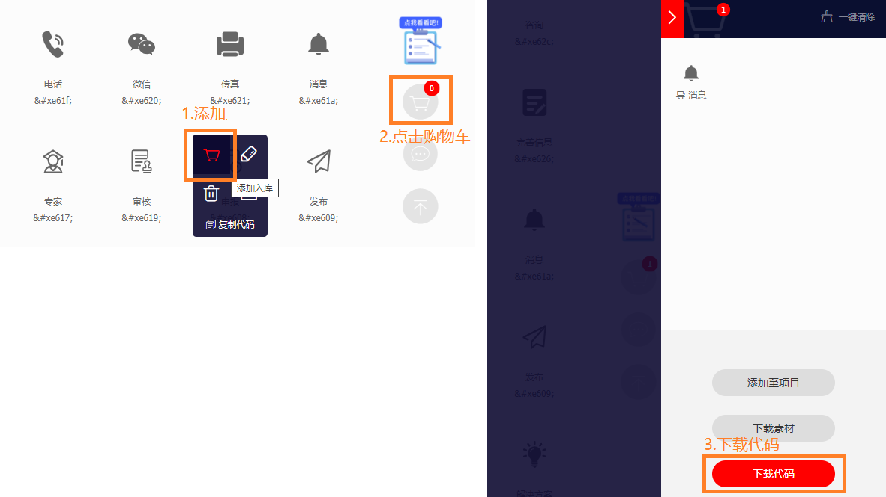
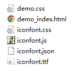
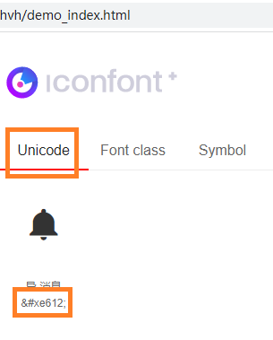

# uni-app 标题栏自定义

uni-app自定义导航栏|仿微信顶部导航uni_headerBar，支持标题居左、居中、搜索条，按钮可传入文字/字体图标/图片   

## 修改uniApp原生导航栏

uni-app原生导航栏也能实现一些顶部自定义按钮+搜索框，只需在page.json里面做一些配置即可    
官网：https://uniapp.dcloud.io/collocation/pages.html#style    

1. 去iconfont官网 https://www.iconfont.cn/ 选取你想要的图标，加入购物车，打开购物车，下载代码    
    
2. 解压缩，将其中的iconfont.ttf文件更名后放入项目src/static路径下    
    
3. 修改src/pages.json文件配置app-plus    
```
"pages": [ //pages数组中第一项表示应用启动页，参考：https://uniapp.dcloud.io/collocation/pages
  {
    "path": "pages/home/index",
    "style": {
      "app-plus": {
        "titleNView": {
          "titleColor": "#333",
          "titleSize": "36rpx",
          "backgroundColor": "#FFF",
          "buttons": [
	    {
	      "text": "\ue647",
	      "fontSrc": "/static/icon-user.ttf",
	      "fontSize": "48rpx",
	      "float": "right"
	    },
            {
              "text": "\ue612",
              "fontSrc": "/static/icon-alarm.ttf",
              "fontSize": "48rpx",
              "float": "right"
            }
          ]
        }
      }
    }
  },
  // ... 其他代码 ...
]
```
其中text是字体编码，iconfont页面上可以看到，也可以打开压缩包中的demo_index.html获取    
例如我这里就是612    
    

**注意：**  这里两个图标都"float": "right"，和网页float一样，写在最前面的会最靠右，且index值越小    

4. 监听标题栏按钮、输入框事件    
uni-app给出了相应API：onNavigationBarButtonTap和onNavigationBarSearchInputChanged，写在相应的页面中即可    
```
export default Vue.extend({
  // ... 其他代码 ...
  onNavigationBarButtonTap(e) {
    Number(e.index) === 0 && uni.navigateTo({ url: `${RoutePatterns.MINE_INDEX}` });
    Number(e.index) === 1 && uni.navigateTo({ url: `${RoutePatterns.NOTIFICATION_ALARM}` });
  },
})
```

**偶然的小发现：** 如果底部导航栏tabBar有设置入口，标题栏按钮入口好像会失效    


## uniApp自定义导航栏

将navigationStyle设为custom或titleNView设为false时，原生导航栏不显示，这时就能自定义导航栏    


参考： 
- https://blog.csdn.net/qq_35898865/article/details/105639507
- https://blog.csdn.net/yanxinyun1990/article/details/100919657
