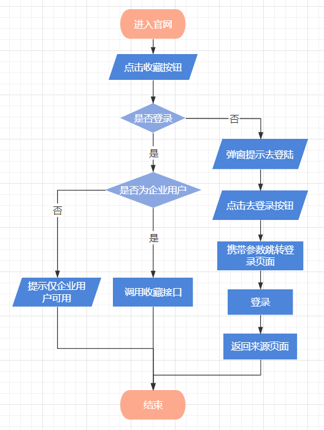
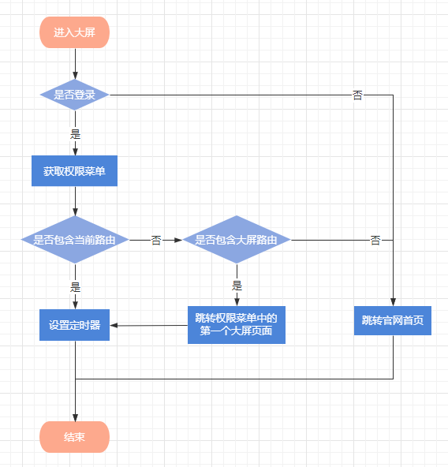

# 区域大屏项目经验整理
- 2022-04-28

 
目录    
1	项目构建    
2	权限控制    
2.1	403自动跳转登录    
2.2	去登陆    
2.3	角色权限    
2.4	菜单权限    
3	大屏高德地图    
3.1	引入    
3.2	初始化    
3.3	地图标注创建    
4	大屏区块图    
4.1	Svg拼凑    
4.2	事件监听    
5	图表组件提取    
5.1	满足大屏端/工作台样式    
5.2	适配不同的数据结构的后台返回    


**该文档面向前端开发人员，用于为区域项目开发设计提供文档参考。其中部分经验也适用于一般项目开发设计。   
项目采用TypeScript编写，关键依赖版本如下：**    
"@antv/g2": "^4.1.46",    
"antd": "^4.15.3",    
"axios": "^0.20.0",    
"core-js": "^3.6.5",    
"echarts": "^5.2.2",    
"mobx": "^4.15.7",    
"react": "^16.13.1",    
"webpack": "^4.44.2",    
 

## 项目构建
目前涉及的区域项目一般都包括官网、工作台、大屏。官网/工作台与大屏存在一些差异，需要在项目构建之初就要考虑的：    
- 分辨率差异：官网/工作台在PC上显示，分辨率一般需要适配1280、1440、1920，大屏目前一般需要适配3840且随意缩放。所以区域项目大屏端会单独一个入口。    
另外提取公共组件时，如果需要大屏和工作台都能适用的话，需要考虑更多的样式配置。    
- 视觉设计差异：大屏一般为暗色，官网/工作台一般为亮色，加上分辨率的问题，所以大屏会单独一套样式。    
- 组件适用差异：大屏如果为满足随意缩放，样式用了transform: scale，那么大屏中的Antd弹窗/下拉等组件定位异常，如果有用到往往需要自定义。    
Antv/g2图表的tooltip定位也会异常，所以图表组件封装时，tooltip需要使用模板定义的方式。    

综上，项目构建时至少需要做以下几件事：    
- 1	Webpack配置多入口    
```
//------（build/base.config.ts）------
const htmlWebpackPlugins = Object.keys(entryConfigs).map((entryName) => {
  const {
    title = '',
    template = defaultHtmlTemplatePath,
  } = entryConfigs[entryName]
  return new HtmlWebpackPlugin({
    title,
    template,
    inject: false,
    filename: `${entryName}.html`,
    favicon: './favicon.ico',
    chunks: ['common', 'vendor', `${entryName}`],
    minify: {
      html5: true,
      minifyCSS: true,
      minifyJS: true,
      removeComments: true,
      removeEmptyAttributes: true,
      removeRedundantAttributes: true,
    },
  })
})
```

- 2	大屏全局监听resize事件实现随意缩放
``` 
//------（entry/ govern-screen-entry.tsx）------
useEffect(() => {
    getMemu()
    windowZoom({ originWidth: 3840, minWidth: 1280 })
    const handleChangeHtmlFontSize = () => {
      windowZoom({ originWidth: 3840, minWidth: 1280 })
    }
    window.addEventListener('resize', handleChangeHtmlFontSize)
    return () => {
      window.removeEventListener('resize', handleChangeHtmlFontSize)
      govern_screen_timer && simulateClearInterval(govern_screen_timer)
    }
  }, [])
```
```
//------（utils/window-adaption.ts）------
export function windowZoom(data: remAdaptionInfo): void {
  const { originWidth = 3840, minWidth = 1280 } = data
  const innerWidth = window.innerWidth
  if (!innerWidth) return
  document.getElementsByTagName('body')[0].style.transform = `scale(${
    Math.max(innerWidth, minWidth) / originWidth
  })`
}
```

- 3	单独文件夹存放大屏端全局css文件，且body样式如下：    
```
//------（css/screen/default.scss）------
body {
  width: 3840px !important;  //加important是为了保证大屏中的Modal正常
  height: 2160px;
  transform: scale(1);
  transform-origin: left top;
  overflow-y: hidden;
  overflow-x: auto;
}
```

- 4	必要时css使用```@media screen and (max-width: 1600px)```适配屏幕宽度

## 权限控制
### 403自动跳转登录
这部分需要后台配合，对接口进行权限控制，没有权限的用户或者未登录的用户去调用一些接口时将返回403状态码，前端监听response状态码，若为403则清除用户信息跳转到登录页面。    
```
//------（pages/index.tsx）------
requestInterceptor.response.use(
  (response) => response,
  (error) => {
    if (error?.response?.status == 403) {
      Storage.remove(STORAGE_KEYS.TOKEN)
      Storage.remove(STORAGE_KEYS.USER_ID)
      location.href = encodeRoute(RoutePatterns.ROUTE_LOGIN)
    }
    return Promise.reject(error)
  },
)
```
```
//------（service/http_request/requests.ts）------
export const requestInterceptor = axios.interceptors
```

### 去登陆
一些功能需要用户登录之后才能使用的就涉及去登陆交互。目前的通用实现是在用户想要使用特定功能时触发Hook，验证用户当前是否为已登录状态，    
若未登录则弹窗提示，点击弹窗中的去登录按钮，携带当前路由于URL的查询参数上跳转登录页面，登录成功后返回来源页面。    
```
//------（components/hooks/auth-hooks.ts）------
const handleModal = async (data: {
    content?: string
    okText?: string
    onOk?: () => void
    onCancel?: () => void
  }) => {
    const { content, okText, onOk, onCancel } = data || {}
    Modal.confirm({
      title: '提示',
      content,
      closable: true,
      okText,
      onOk,
      onCancel,
    })
  }

  // 未登录提示(tip: 提示语言, isEnter: 是否跳转到登录页)
  const checkLoginWithWarning = () => {
    return new Promise((resolve, reject) => {
      if (isLogin) {
        resolve('')
        return
      }
      // 未登录
      handleModal({
        content: '请先登录账号',
        okText: '去登录',
        onOk: () => {
          enterPageWithHistory(RoutePatterns.ROUTE_LOGIN)
        },
      })
      reject('is-not-login')
    })
  }
```

### 角色权限
区域项目一般有企业用户和政府用户两大账号类型，一些功能需要特定角色的用户才能使用。这些功能也一定会结合去登陆交互实现。以官网收藏功能为例，其实现流程大致如下：    
    
目前的通用实现也是在用户想要使用特定功能时先触发登陆验证Hook，再触发角色验证Hook，如果角色不符，则message.warn给出提示。    
```
//------（components/hooks/auth-hooks.ts）------
const checkEnterpriseRole = async () => {
    if (
      currentRole !== AccountTypeEnum.ENTERPRISE_MANAGER &&
      currentRole !== AccountTypeEnum.ENTERPRISE
    ) {
      message.warn('仅企业账户可以使用该功能')
      throw new Error('you-are-not-enterprise')
    }
  }
```

### 菜单权限
区域项目一般有企业用户和政府用户两大账号类型，这两大角色相对应的工作台菜单肯定是不同的，另外如果项目需求中有给用户提供角色/权限管理功能，那不同的角色对应的菜单一般也会不同。    
所以开发中工作台的菜单一般需要后端返回，同时需要前端把控，防止用户通过直接输入url进入本该无权访问的页面。以大屏菜单权限控制为例，流程图大致如下：    
    
```
//------（entry/ govern-screen-entry.tsx）------
const getMemu = async () => {
    try {
      const res = await httpGetMenuInfo()
      if (res?.code === 0) {
        const { bigscreen = [] } = res?.data
        authDataStore.setScreenRoutes(getChildRoutes(RoutePatterns.ROUTE_GOVERN_SCREEN, bigscreen))
        // 判断当前url是否存在于权限菜单中
        const authUrls = getUrlsFromRoutes(bigscreen)
        const isCurUrlAuth = authUrls?.some((item: any) => matchRoute(item, true, true))
        // 跳转到相应页面
        if (isCurUrlAuth) {
          getGovernScreenData()
          govern_screen_timer = simulateInterval(() => {
            getGovernScreenData()
          }, 120000)
        } else if (bigscreen?.length) {
          History.replace(screen[0]?.value)
          getGovernScreenData()
          govern_screen_timer = simulateInterval(() => {
            getGovernScreenData()
          }, 120000)
        } else {
          window.location.replace(RoutePatterns.ROUTE_HOME)
        }
      } else {
        throw new Error('菜单获取失败')
      }
    } catch {
      console.log('菜单获取失败')
    }
  }
```

## 大屏高德地图
### 引入
```
------（html/ template.ejs）------
<script src="https://webapi.amap.com/maps?v=1.4.15&key=e5f38ea6d3ce8280f2b3425d723e8ec5"></script>
```
### 显示控制
项目中可能不是每个页面都包含高德地图，所以为了减少资源占用，仅在需要时渲染高德地图组件。    
```
------（entry/ govern-screen-entry.tsx）------
const Location = useLocation()
const showMap = useMemo(() => {
    return [
      RoutePatterns.ROUTE_GOVERN_SCREEN_ECONOMIC,
      RoutePatterns.ROUTE_GOVERN_SCREEN_ENERGY,
    ].includes(Location.pathname)
}, [Location])
...
<GaodeMap show={showMap} />
```
另外组件内部也会有显示控制，详见下文初始化。    

### 初始化
高德地图中的信息窗口对象是唯一的，也就是说同一时间，高德地图上只能展示一个InfoWindow，所以地图初始化的时候可以预先将信息窗口创建好，    
同时立即调用一次.open和.close方法，使窗口内的元素提前创建，之后需要显示的时候再向其中添加Dom，避免频繁的销毁和创建信息窗口。    
为了避免高德地图初始化未完成就显示造成页面闪白，要为其添加complete事件回调进行显示控制。    
```
useEffect(() => {
    if (window?.AMap) {
      map = new AMap.Map(mapRef.current || '', {
        zoom: 17, // 级别: 17级可显示楼宇 18级可显示室内
        zooms: [10, 20], // 默认为 [2, 20], 取值范围 [2 ~ 30]
        center: [118.878367, 31.56419], // 初始地图中心经纬度定位
        pitch: 40, // 俯仰角度默认0, 最大值根据地图当前 zoom 级别不断增大, 2D地图下无效
        rotation: 40, // 地图顺时针旋转角度,取值范围 [0-360], 默认0
        viewMode: '3D',
        isHotspot: false, // 是否开启地图自带的热点和标注的 hover 效果。PC端默认是true, 移动端默认是 false。
        showBuildingBlock: false, //是否展示地图 3D 楼块, 默认 true
        expandZoomRange: true, // 放大倍数最大至20,一般只有19
        mapStyle: 'amap://styles/5d085e24c91283e0719acd74f2f14d20', // 视觉自定义样式
      })
      infoWindow = new AMap.InfoWindow({
        isCustom: true,
        offset: new AMap.Pixel(30, -135),
        content: `
        <div id="info-window" class="info-window">
          <div id="info-window-content" class="info-window-content">
            <div id="info-window-title" class="info-window-title"></div>
            <div id="info-window-radar" class="info-window-radar"></div>
            <div id="info-window-label" class="info-window-label"></div>
            <div id="info-window-value" class="info-window-value"></div>
            <div class="info-window-line-1"></div>
            <div class="info-window-line-2"></div>
            <div class="info-window-line-3"></div>
          </div>
        </div>
        `,
      })
      // 先open一下让元素创建, 远离初始中心值,避免出现在视线中
      infoWindow.open(map, [118, 31], 0)
      infoWindow.close()
      
      // 加载完成显示地图
      map.on('complete', () => {
        createInfoWindowContent()
        setMapInitVis(true)
      })
      // 初始化更新marker
      updateMarkers(Location)
    }
    return () => {
      if (map) {
        map.destroy()
        map = null
        markers = []
      }
    }
  }, [window.AMap])

const createInfoWindowContent = () => {
    const content = document.getElementById('info-window-content')
    const closeX = document.createElement('img')
    closeX.className = 'info-window-close'
    closeX.src = ImageClose
    closeX.onclick = closeInfoWindow //点击右上角的x可以关闭该信息窗体
    content.appendChild(closeX)
  }
```

### 地图标注创建
地图标注数据一般来自于后台请求返回的一个对象数组，对象中包含地标的经纬度和交互需要时需要展示的数据。    
遍历数组，依次创建地标对象并绑定事件监听，将这些地标对象保存到一个数组中。最后调用高德.add方法将其添加到地图上。    
```
const markerNormalContent = ``
  const markerHoverContent = (enterpriseName = '') => `
    <span class="marker-hover-text">${enterpriseName}</span>
    
  `
const updateMarkers = (local) => {
    map.remove(markers)
    markers = []
    switch (local.pathname) {
      case RoutePatterns.ROUTE_GOVERN_SCREEN_ECONOMIC:
        enterpriseOverviewVos?.forEach((orgData: EconomicOverviewInfo) => {
          const { longitude, latitude, taxIdentificationNum, enterpriseName } = orgData || {}
          if (longitude && latitude) {
            const newMarker = new AMap.Marker({
              content:
                taxIdentificationNum === currentTaxNum ? markerHoverContent() : markerNormalContent,
              anchor: 'center',
              position: [longitude, latitude],
            })
            // 事件绑定
            newMarker.on('mouseover', () => {
              if (taxIdentificationNum !== currentTaxNum) {
                newMarker.setContent(markerHoverContent(enterpriseName))
              }
            })
            newMarker.on('click', (e) => {
              const info = document.getElementById('info-window')
              info.style.height = '658px'
              const title = document.getElementById('info-window-title')
              title.innerHTML = enterpriseName
              radarInit(orgData)
              newMarker.setContent(markerHoverContent())
              map.setCenter([longitude, latitude])
              aMapDataStore.setCurrentTaxNum(taxIdentificationNum)
              infoWindow.open(map, e.target.getPosition())
            })
            newMarker.on('mouseout', () => {
              if (taxIdentificationNum !== currentTaxNum) {
                newMarker.setContent(markerNormalContent)
              }
            })
            markers.push(newMarker)
          }
        })
        break
    }
    map.add(markers)
  }
```

## 大屏区块图
### Svg拼凑

*svg示例详见demo/sy-map.svg*
做这种效果出来目前的方法是从视觉同学那里分别要来底图和各分块的svg，用在线svg编辑工具（我一般用菜鸟）去拼凑出一个新的svg。    
交互中需要改变文字样式的话文字也要自行添加，拼凑过程中尽量删除一些无用的嵌套层。    
如果分块比较多的话这一步会非常耗时，而且视觉给的svg也会经常不符合要求，需要去沟通，或者自行修改svg里的代码。    

### 事件监听
想要区块上有悬浮/点击等交互时，需要先在上一步拼凑出的svg中去给需要控制的标签(```<g>/<text>等```)添加id：    

然后在代码中绑定监听
```
useEffect(() => {
    if (mapActiveBtn === 0) {
      document.getElementById(`svg-map-sy`)?.addEventListener('mouseout', () => {
        setHoverRegional('')
      })
      regionList.forEach((key) => {
        document.getElementById(`svg-zone-${key}`)?.addEventListener('mouseover', () => {
          setHoverRegional(key)
        })
        document.getElementById(`svg-zone-${key}`)?.addEventListener('mouseenter', () => {
          setHoverRegional(key)
        })
        document.getElementById(`svg-zone-${key}`)?.addEventListener('click', () => {
          setRegional(key)
        })
      })
    } else if (mapActiveBtn === 1) {
      parkList.forEach((key) => {
        document.getElementById(`svg-park-${key}`)?.addEventListener('mouseover', () => {
          setHoverPark(key)
        })
        document.getElementById(`svg-park-${key}`)?.addEventListener('mouseenter', () => {
          setHoverPark(key)
        })
        document.getElementById(`svg-park-${key}`)?.addEventListener('mouseout', () => {
          setHoverPark('')
        })
        document.getElementById(`svg-park-${key}`)?.addEventListener('click', () => {
          setPark(key)
        })
      })
    }
  }, [mapActiveBtn])

  useEffect(() => {
    if (mapActiveBtn === 0) {
      regionList.forEach((key) => {
        if (regional === key || hoverRegional === key) {
          document
            .getElementById(`svg-zone-${key}`)
            ?.setAttribute('style', 'fill:url(#svg-zone-hover)')
          document.getElementById(`svg-zone-text-${key}`)?.setAttribute('class', 'zone-text-hover')
        } else {
          document
            .getElementById(`svg-zone-${key}`)
            ?.setAttribute('style', 'fill:rgba(61, 175, 255, 0)')
          document.getElementById(`svg-zone-text-${key}`)?.setAttribute('class', 'zone-text')
        }
      })
    } else if (mapActiveBtn === 1) {
      parkList.forEach((key) => {
        if (park === key || hoverPark === key) {
          document
            .getElementById(`svg-park-${key}`)
            ?.setAttribute('style', 'fill:url(#svg-park-hover)')
          document.getElementById(`svg-park-line-${key}`)?.setAttribute('style', 'stroke:#FFD226')
          document.getElementById(`svg-park-text-${key}`)?.setAttribute('style', 'fill:#FFD226')
        } else {
          document.getElementById(`svg-park-${key}`)?.setAttribute('style', 'fill:#BBBBBB')
          document.getElementById(`svg-park-line-${key}`)?.setAttribute('style', 'stroke:#FFFFFF')
          document.getElementById(`svg-park-text-${key}`)?.setAttribute('style', 'fill:#FFFFFF')
        }
      })
    }
  }, [mapActiveBtn, regional, hoverRegional, park, hoverPark])
```

## 图表组件提取

*图表组件封装代码详见demo/chart-component*

### 满足大屏端/工作台样式
大屏端和工作台的字号/颜色差异很大，所以提取公共组件时要写两套样式或直接所有的样式参数都能配置。像图表这种可以跨项目的组件，更适合第二种方案。以直方图为例，样式相关配置项定义如下：    
```
interface AxisOption {
  labelFill?: string
  labelFontSize?: number
  labelFontWeight?: number
  gridStroke?: string
  gridLineWidth?: number
  gridLineDash?: number[]
  lineStroke?: string
  lineLineWidth?: number
}

interface UnitOption {
  x?: number
  y?: number
  fill?: string
  fontSize?: number
  fontWeight?: number
}

interface LegendOption {
  position?: string
  maxItemWidth?: number
  itemSpacing?: number
  itemNameFill?: string
  itemNameFontSize?: number
  itemNameFontWeight?: number
  markerSymbol?: string
  markerSpacing?: number
  markerR?: number
  pageMarkerInactiveFill?: string
  pageMarkerInactiveOpacity?: number
  pageMarkerFill?: string
  pageMarkerOpacity?: number
  pageMarkerSize?: number
  pageTextFill?: string
  pageTextFontSize?: number
}

interface TooltipOption {
  // 容器
  opacity?: number
  background?: string
  boxShadow?: string
  borderRadius?: string
  // title
  titleColor?: string
  titleFontSize?: string
  titleFontWeight?: number
  titleMarginBottom?: string
  // item
  itemColor?: string
  itemOpacity?: number
  itemFontSize?: string
  itemFontWeight?: number
  itemMarginBottom?: string
}
```
**目前我封装的图表组件中雷达图使用echarts外，其他都使用g2，因为echarts雷达图可以最大值自动，且图形绘制逻辑和tooltip数据显示能够分别控制，这一点目前看g2好像做不到。 **

### 适配不同的数据结构的后台返回
目前图表绘制数据后台返回的数据结构正常有两种形式（雷达图除外）：    
一种是数组，形如：    
```[{groupKey:string, xKey:string, yKey:string|number }]```
一种是对象，形如：    
```{ groupKey1:[{xKey, yKey}], groupKey2:[{xKey, yKey}] }```
*但现在也出现了类似第三种结构，形如：    
```[{xKey:string, yKey1:string|number, yKey2:string|number }]```
这种结构似乎比第二种结构更合理，但目前只有line-chart我做了改造。*    

所以为了适配这两种数据结构，我在组件的props参数中定义了:   
```
// 1.无分组对比时必须传"none", 此时一般需要showLegend传false
  // 2.data是数组&分组对比时需要, 优先级高于groupList
  groupKey?: string
  // 1.无分组对比时(groupKey传"none")
  // 2.data是对象&分组对比时配置, 适用于分组字段固定的情景
  groupList?: GroupItem[]
```
```
interface GroupItem {
  key?: string // 用于对data做进一步处理取对应字段
  label?: string // 用于图例和tooltip
}
```

对应的数据处理如下：    
```
// 这里的目的是生成标准化的，g2可识别的干净的数据（mobx数据不识别）
    useEffect(() => {
      if (!data) {
        setDataList([])
        return
      }
      if (groupKey) {
        const pureList = data?.map((item) => {
          return {
            name: item[groupKey] || '',
            x: item[xKey],
            y: item[yKey] && item[yKey] !== 0 ? Number(item[yKey]) : null,
          }
        })
        setDataList(pureList)
        return
      }
      const newList = []
      groupList &&
        groupList?.map((item: GroupItem) => {
          const { key, label } = item || {}
          data[key]?.map((el) => {
            newList.push({
              name: label,
              x: el[xKey],
              y: el[yKey] && el[yKey] !== 0 ? Number(el[yKey]) : null,
            })
          })
        })
      setDataList(newList)
    }, [data])
```


