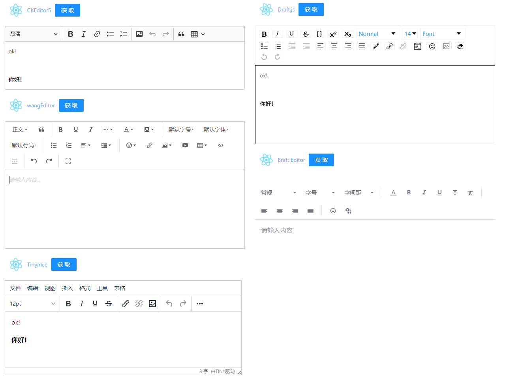

# 富文本编辑器调研

**结论先行：** 本调研共搜罗选取了5种富文本编辑器，分别是Draft.js，Tinymce，Braft Editor，CKEditor5，wangEditor，分别从文档完整度，使用体验，使用方法便捷度，外观等多角度进行对比。    
其中在文档方面 Braft Editor表现较差，wangEditor表现不佳；外观方面Draft.js表现较差，且在使用体验方面也表现不佳；使用方法方面Tinymce表现较差，因此最终选型为CKEditor5。    
除此之外，CKEditor5在简单易用，功能扩展性，适配性(React/Vue项目中使用)等方面也同样表现突出。    

## 5种富文本编辑器简介

- Draft.js：一个用来构建 React 富文本编辑器的框架，支持 Immutable 模型和跨浏览器兼容性。
- Tinymce：一款易用、且功能强大的所见即所得的富文本编辑器。同类程序有：UEditor、Kindeditor、Simditor、CKEditor、wangEditor、Suneditor、froala等等。
- Braft Editor：一个基于Draft.js封装的富文本编辑器。
- CKEditor5：CKEditor5是一个超现代的JavaScript富文本编辑器，具有MVC架构，自定义数据模型和虚拟DOM。它是在ES6中从零开始编写的，并且有很好的webpack支持。    
  你可以使用Angular、React和Vue.js的本地集成。
- wangEditor：一款国产富文本编辑器，V5目前还在公测阶段。wangEditor 基于 slate 内核开发，但不依赖于 React ，所以它本身是无框架依赖的。

## 文档对比
我将是否可以轻松从网上找到其官网，文档，Github地址，文档是否更新及时作为考核指标，对比情况如下：

### Draft.js
- Github: https://github.com/facebook/draft-js
- 官网：https://draftjs.org/
- 文档：https://roger1253.gitbooks.io/draft-js/content/ 

### Tinymce
- Github: https://github.com/tinymce
- 官网：https://www.tiny.cloud/
- 文档：http://tinymce.ax-z.cn/

### Braft Editor （文档找不齐）
- 文档：https://www.worldlink.com.cn/en/osdir/braft-editor.html

### CKEditor5
- Github: https://github.com/ckeditor/ckeditor5
- 官网：https://ckeditor.com/ckeditor-5/
- 文档：https://ckeditor.com/docs/ckeditor5/latest/index.html

### wangEditor （文档较落后）
- Github: https://github.com/wangeditor-team
- 官网：https://www.wangeditor.com/
- 文档：https://www.wangeditor.com/v5/guide/getting-started.html

以上，除Braft Editor和wangEditor外都表现良好。

## 使用方法及操作体验对比
我将引入形式是否友好，自定义改动量大小作为考核指标，对比情况如下(具体代码参考演示项目)：

### Draft.js  (操作体验较差)
- step1：```yarn add draft-js draftjs-to-html react-draft-wysiwyg```
- step2：自定义组件my-draft.js
- step3：<DraftRichtext detail={ initText } ></DraftRichtext>

### CKEditor5 (使用简单 操作体验优)
- step1：```yarn add @ckeditor/ckeditor5-react @ckeditor/ckeditor5-build-classic```
- step2： 
```
import { CKEditor } from '@ckeditor/ckeditor5-react'
import ClassicEditor from '@ckeditor/ckeditor5-build-classic'
import '@ckeditor/ckeditor5-build-classic/build/translations/zh-cn.js'

...

<CKEditor 
   editor={ClassicEditor}
   data={initText}
   onReady={editor => {
       setCkEditor(editor)
   }}
   config={{language: 'zh-cn'}} // 汉化
/>
<button onClick={handleGetCKEditorData}>获取</button>
```
- step3：：
```
const handleGetCKEditorData = () => {
    console.log(ckEditor.current.editor.getData())
}
```

### Tinymce （操作体验优 但引入方式不友好）
- step1：```yarn add tinymce @tinymce/tinymce-react``` 
- step2：演示项目中的文件夹tinymce
- step3：index.html中引入```<script src="%PUBLIC_URL%/tinymce/tinymce.min.js"></script>```
- step4：演示项目中的my_tinymce
- step5：App.js中使用
      ```<TinymceRichtext editorHtml={editorHtml}
        handleEditorTextChange={handleEditorTextChange}
        handleImageUpload={handleImageUpload} />
        ```

### wangEditor（国产 公测中 官方文档更新不及时）
- step1：```yarn add @wangeditor/editor @wangeditor/editor-for-react
- step2：创建文件my-wang.js
- step3：App.js中使用```<WangRichtext />```

### Braft Editor (文档少 没太搞定)
- step1：```yarn add braft-editor braft-polyfill prop-types```
- step2：创建文件夹AppEditor_BE 封装组件     
  //参考https://blog.csdn.net/qq_39953537/article/details/100051130
- step3：App.js中使用```<BEDraftRichtext />```

以上，CKEditor5表现突出。

## 外观对比
无自定义改造情况下的外观对比：    


以上，除Draft.js外都表现良好。

## 参考资料
- Draft.js
  使用参考：https://blog.csdn.net/weixin_39893889/article/details/102610043    
  demo案例：https://codesandbox.io/examples/package/@types/react-draft-wysiwyg    
- Tinymce
  使用参考：    
  下载链接：https://www.tiny.cloud/get-tiny/self-hosted/    
  https://www.tiny.cloud/get-tiny/language-packages/    
- Braft Editor（基于Draft.js开发的编辑器）
  使用参考：https://blog.csdn.net/qq_39953537/article/details/100051130    
- CKEditor5
  使用参考：https://juejin.cn/post/6971365781472804900    
  https://ckeditor.com/docs/ckeditor5/latest/builds/guides/integration/saving-data.html    
- wangEditor（国产 公测中）
  使用参考：https://juejin.cn/post/7030584414652334093    


